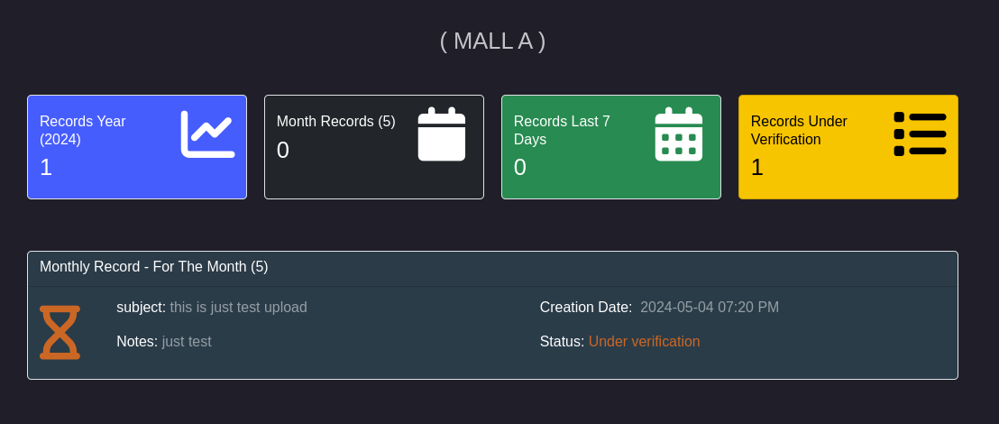
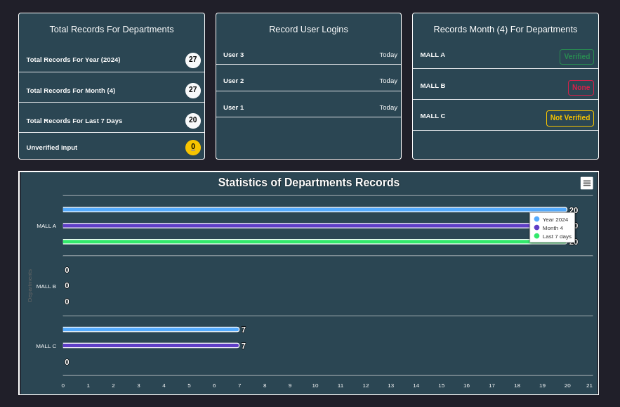
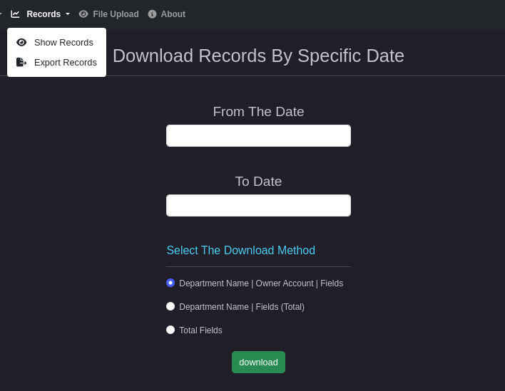

# Welcome to Enterprise Records Mall!
The **Enterprise Records Mall** is designed to streamline record and data management for **companies** and **institutions**. Administrators can create departments, assign users to them, and manage their data access. Users see their department name upon login and can manage sales records and generate reports.

Here's a detailed overview of the features available in the user and admin control panels:

## Installation
To install Enterprise Records Mall, follow the instructions provided in the [Install Page](INSTALL.md).

## User Control Panel
1. Displays the count of records in the user's department for a specified period.
2. Allows the addition of sales records and the submission of monthly reports.
3. Shows the verification status of uploaded files.

**Note:** All records and files uploaded by users remain unverified until an administrator reviews and approves them.

## Admin Control Panel
1. Provides statistics on entries for the current year, month, and last 7 days, with graphical data representation.
2. Offers comprehensive user management capabilities including creating, viewing, editing, disabling, and deleting user accounts.
3. Allows department management, including creation, modification, and deletion.
4. Facilitates record management with options to view, filter, and extract data based on specified criteria.
5. Enables data download by department, date, and specific fields.

**File Upload Status**
- **None:** Indicates no activity by the department.
- **Not Verified:** The department has uploaded data, but it hasn’t been verified by an admin.
- **Verified:** The admin has verified the data. Once verified, the department cannot modify it.

## Data Extraction
Verified records can be extracted from the database within a specified date range.

**Download Options**
1. By department name, account owner name, and date, including all verified database entries.
2. By department name, showing only the total count of fields added per department.
3. By the total sum of fields across all departments.

## Additional Notes
1. Users within the same department cannot edit or delete each other's records.
2. Records and file uploads are sorted by the date field.
3. Users are sorted by their login time.
4. Records and file uploads created by a user will not appear on the homepage or in extracts until verified by an admin.

## Video 

# MIT License
